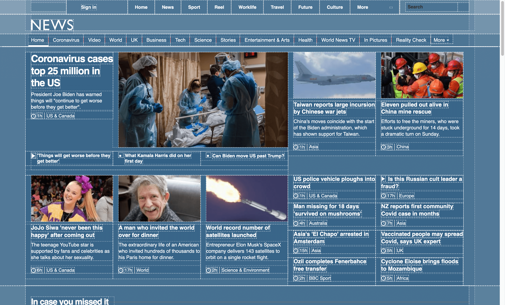

# CSS Outline

CSS Outline bookmarklet

This is a simple [bookmarklet](https://en.wikipedia.org/wiki/Bookmarklet) that will outline all the elements on the page you are viewing.

This is useful for debugging purposes as you can see the structure of your page visually.

## How to use

1. Create a new bookmark in your browser and paste the following code in the URL field.

```js
javascript:if%20(!(%22is_debugging%22%20in%20window))%20%7B%0A%20%20is_debugging%20%3D%20false%3B%0A%20%20var%20debug_el%20%3D%20document.createElement(%22style%22)%3B%0A%20%20debug_el.append(%0A%20%20%20%20document.createTextNode(%0A%20%20%20%20%20%20%60*%3Anot(path)%3Anot(g)%20%7B%20%0A%20%20%20%20%20%20%20%20%20%20color%3A%20rgb(255%20255%20255)%20!important%3B%0A%20%20%20%20%20%20%20%20%20%20background%3A%20rgb(49%2095%20130%20%2F%2020%25)%20!important%3B%0A%20%20%20%20%20%20%20%20%20%20outline%3A%20dashed%201px%20rgb(255%20255%20255%20%2F%2050%25)%20!important%3B%0A%20%20%20%20%20%20%20%20%20%20box-shadow%3A%20none%20!important%3B%20%7D%60%0A%20%20%20%20)%0A%20%20)%3B%0A%7D%0Afunction%20enable_debugger()%20%7B%0A%20%20if%20(!is_debugging)%20%7B%0A%20%20%20%20document.head.appendChild(debug_el)%3B%0A%20%20%20%20is_debugging%20%3D%20true%3B%0A%20%20%7D%0A%7D%0A%0Afunction%20disable_debugger()%20%7B%0A%20%20if%20(is_debugging)%20%7B%0A%20%20%20%20document.head.removeChild(debug_el)%3B%0A%20%20%20%20is_debugging%20%3D%20false%3B%0A%20%20%7D%0A%7D%0A!is_debugging%20%3F%20enable_debugger()%20%3A%20disable_debugger()%3B%0A
```

2. Click the bookmark to toggle CSS outline on or off.

## Screenshot



---

This code is originally from zaydek.github.com/debug.css which is not available anymore. You can also read about the thought process behind this bookmarklet from [this article](https://forum.freecodecamp.org/t/here-s-my-favorite-weird-trick-to-debug-css/189151).
